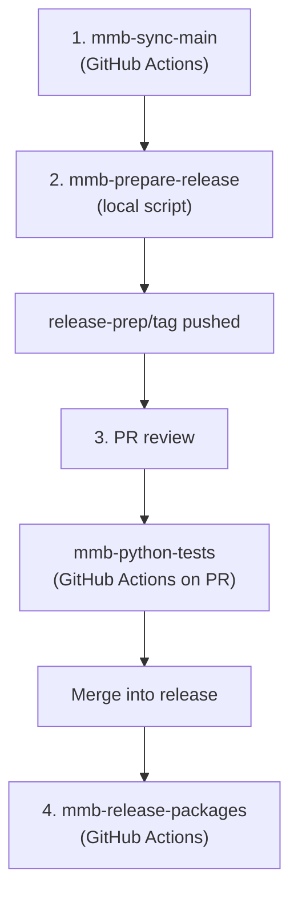

# MMB Prefect Fork — Documentation

This guide explains how the MedMera Bank (MMB) fork of [PrefectHQ/prefect](https://github.com/PrefectHQ/prefect) is maintained, updated, tested, and released.

MMB keeps a small set of custom changes (IAP authentication, GCP Artifact Registry publishing, custom Dockerfiles, etc.) on a long-lived `release` branch while tracking upstream Prefect releases.

---

## Quick reference: updating to a new upstream release

When Prefect publishes a new version (e.g. `3.4.25`), follow these steps in order:

| Step | Where | Action |
|------|-------|--------|
| 1 | GitHub Actions | Dispatch **MMB - Sync Main & Tags** (`mmb-sync-main`) |
| 2 | Local machine | Run `./scripts/mmb-prepare-release.sh 3.4.25` (or `just mmb-prepare-release 3.4.25`) |
| 3 | GitHub | Review the PR → wait for **MMB - Unit tests** CI → merge into `release` |
| 4 | GitHub Actions | Dispatch **MMB - Release Packages** (`mmb-release-packages`) |

Use `--dry-run` on steps 1 and 2 first if you want to preview changes.

---

## Branch structure

| Branch | Purpose |
|--------|---------|
| `main` | Mirrors upstream `PrefectHQ/prefect` main — **do not commit MMB changes here** |
| `release` | Long-lived branch where all MMB customisations live |
| `release-prep/<tag>` | Temporary branch per release cycle (e.g. `release-prep/3.4.25`); delete after merge |

Upstream tags (e.g. `3.4.25`, `prefect-gcp-0.6.17`) are mirrored to this fork by `mmb-sync-main`. Package versions on `release` are derived from the nearest ancestor tag via `git describe`.

---

## Local setup

Install these tools before your first release prep.

### Git remotes

```bash
git remote -v
# origin    → your fork (MedMera)
# upstream  → https://github.com/PrefectHQ/prefect.git
```

If `upstream` is missing:

```bash
git remote add upstream https://github.com/PrefectHQ/prefect.git
git fetch upstream --tags
```

### GitHub CLI (`gh`)

Required for opening release PRs locally.

```bash
brew install gh          # macOS
gh auth login
gh auth status           # verify
```

You need permission to push branches and create pull requests on the fork.

### `just` (command runner)

[`just`](https://github.com/casey/just) is a small task runner (like `make`) that reads recipes from [`justfile`](justfile). It is optional — every `just` command has an equivalent script invocation — but it makes common tasks easier to discover.

```bash
brew install just        # macOS
just --list              # show available recipes
```

MMB-related recipe:

```bash
just mmb-prepare-release 3.4.25
# equivalent to:
./scripts/mmb-prepare-release.sh 3.4.25
```

Other useful project recipes: `just install`, `just docs`.

### Python / uv (for local development and tests)

```bash
uv sync                  # or: just install
uv run pytest tests/...  # run tests locally before opening PRs
```

---

## What runs in CI vs locally



| Component | Runs where | Trigger | Purpose |
|-----------|------------|---------|---------|
| **MMB - Sync Main & Tags** | GitHub Actions | Manual (`workflow_dispatch`) | Fast-forward `main` to upstream; push all upstream tags |
| **mmb-prepare-release** | **Local script** | You run it | Merge upstream tag into `release-prep/<tag>`, resolve conflicts, open PR |
| **MMB - Unit tests** | GitHub Actions | PR + push to `main` | Run test suite on changed code |
| **MMB - Release Packages** | GitHub Actions | Manual (`workflow_dispatch`) | Build and publish Python packages + Docker images to GCP |

### Why prepare-release is local

The previous GitHub Actions workflow for prepare-release failed at PR creation due to token/permissions limits. Running locally uses your own git and `gh` credentials, and lets you resolve merge conflicts interactively (editor, `git mergetool`) **before** anything is pushed.

---

## Step-by-step: updating to a new upstream release

### Step 1 — Sync main and tags (GitHub Actions)

**Workflow:** `.github/workflows/mmb-sync-main.yaml`  
**Display name:** MMB - Sync Main & Tags

1. Open the **Actions** tab on the fork
2. Select **MMB - Sync Main & Tags** → **Run workflow**
3. Optionally enable **dry run** to preview
4. Run

This:

- Fast-forwards `main` to match `PrefectHQ/prefect` main
- Pushes all upstream tags to the fork (e.g. `3.4.25`, `prefect-gcp-0.6.17`)

Always run this before prepare-release so the target tag exists on `origin`.

---

### Step 2 — Prepare release (local)

**Script:** `scripts/mmb-prepare-release.sh`  
**Library:** `scripts/prepare-release-branch-lib.sh`

**Prerequisites:**

- Step 1 completed
- Clean working tree (`git status` shows nothing to commit)
- `gh auth login` done

```bash
# Preview (no changes made; gh auth not required)
./scripts/mmb-prepare-release.sh --dry-run 3.4.25

# Full run: merge, resolve conflicts if any, push, open PR
./scripts/mmb-prepare-release.sh 3.4.25

# Or via just
just mmb-prepare-release 3.4.25
```

| Flag | Description |
|------|-------------|
| `--dry-run` | Preview branch plan and commits to merge |
| `--no-pr` | Push branch but skip `gh pr create` |
| `--no-open` | Create PR but do not open browser |

**What the script does:**

1. Fetches `upstream` and `origin` tags
2. Creates `release-prep/3.4.25` from `origin/release`
3. Runs `git merge 3.4.25`
4. On conflicts: pauses for interactive resolution (see below)
5. Pushes the branch and opens a PR → `release` via `gh`

**Resolving conflicts interactively**

If the merge conflicts, the script lists conflicted files and enters a prompt loop:

| Key | Action |
|-----|--------|
| Enter | Continue after you have resolved conflicts in your editor |
| `m` | Run `git mergetool` |
| `s` | Show `git status --short` |
| `d FILE` | Show diff for a file |
| `l` | List conflicted files again |
| `a` | Abort merge and exit |

The script refuses to commit until all unmerged paths and conflict markers (`<<<<<<<`, etc.) are gone. You get a clean merge commit before anything is pushed.

**Headless alternative:** `scripts/prepare-release-branch.sh` performs the git steps without interactive resolution or PR creation. It exits on conflicts unless `--commit-conflicts` is passed (emergency use only).

---

### Step 3 — Review PR and merge (GitHub + CI)

After step 2, a PR is opened: `release-prep/3.4.25` → `release`.

1. Review the diff on GitHub
2. Wait for **MMB - Unit tests** to pass

**CI trigger:** `.github/workflows/mmb-python-tests.yaml` runs on pull requests that touch Python source, tests, `pyproject.toml`, `Dockerfile`, etc. A typical upstream merge PR will satisfy these path filters.

**IAP and client auth (check on every upstream merge)**

When upstream touches client or connection code, scan the merge diff for:

1. **`src/prefect/_internal/version_checking.py`** — Must still apply `IAPAuth` when `[api.iap] enabled` (mirror `get_client()`). Upstream may rewrite this module (Prefect 3.7+ added it); re-apply the `[MMB]` patch if conflict resolution dropped IAP.
2. **`src/prefect/client/orchestration/__init__.py`** — `get_client()` must still set `httpx_settings["auth"] = IAPAuth()` when IAP enabled.
3. **`src/prefect/_internal/websockets.py`** — Must still inject IAP headers via `IAPTokenManager` when IAP enabled.
4. **`src/prefect/client/iap_auth.py`** — MMB-specific; should not be deleted by merge. If upstream adds their own IAP support, reconcile rather than drop.
5. **New standalone HTTP to the API** — Grep the PR diff for `httpx.AsyncClient(` / `httpx.Client(` combined with `/admin/version` or `PREFECT_API_URL`. Any new path must use `get_client()` or copy the IAP guard from `get_client()`. Today only `version_checking.py` is the exception.
6. **New WebSocket clients** — Must use `websocket_connect()` from `_internal/websockets.py`, not raw `websockets.connect()`.
7. **Settings** — `[api.iap]` keys in `src/prefect/settings/models/api.py` must remain; upstream renames of env vars need MMB profile updates.

Quick grep during PR review (copy-paste):

```bash
# After resolving merge conflicts locally on release-prep/X.Y.Z:
git diff release...HEAD -- 'src/prefect/_internal/version_checking.py' \
  'src/prefect/client/orchestration/__init__.py' \
  'src/prefect/_internal/websockets.py' 'src/prefect/client/iap_auth.py'

rg 'httpx\.(AsyncClient|Client)\(' src/prefect/_internal/version_checking.py \
  src/prefect/client/ src/prefect/events/ src/prefect/logging/

uv run pytest tests/_internal/test_version_checking.py \
  tests/client/test_prefect_client.py -k "CheckServerVersion or version_check" -x
```

3. Merge the PR when green

The `release` branch now contains upstream changes plus all MMB customisations. Delete `release-prep/3.4.25` after merge.

If you need further edits after the PR is open:

```bash
git fetch origin
git checkout release-prep/3.4.25
# edit, then:
git add <files>
git commit -m "address review feedback for 3.4.25 merge"
git push origin release-prep/3.4.25
```

---

### Step 4 — Release packages (GitHub Actions)

**Workflow:** `.github/workflows/mmb-release-packages.yaml`  
**Display name:** MMB - Release Packages

Run only after the prepare-release PR is merged into `release`.

1. Open **Actions** → **MMB - Release Packages** → **Run workflow**
2. Choose options:

| Input | Description |
|-------|-------------|
| `release_python` | Build and publish Python wheels/sdists |
| `release_docker` | Build and push Docker images |
| `build_integrations` | Include integration packages (e.g. `prefect-gcp`) |
| `dry_run` | Preview without publishing |
| `force_release_version` | Require strict `x.y.z` version (no pre-release suffixes on base) |
| `version_post` | PEP 440 post number for prefect (empty = none; `1` → `.post1`) |
| `integration_version_post` | Post number for integrations (empty = none; independent of core) |
| `base_version_override` | Force core base `x.y.z` (empty = auto from nearest upstream ancestor tag) |

The workflow builds from `release` HEAD. Base versions come from the nearest **upstream-style** ancestor tag on HEAD (`git describe`); trailing `-mmb` on describe results is stripped. Python and Docker use the same resolution (`scripts/release-version-lib.sh`).

**MMB release tags:** after a successful publish, `scripts/create-mmb-release-tags.sh` creates annotated tags like `3.4.25-mmb`, `prefect-gcp-0.6.17-mmb`, or `3.7.2.post1-mmb` on the released commit. Dry runs skip tagging. Re-runs are idempotent unless a tag already points at a different commit.

### Post-release (MMB patch)

When Artifact Registry already has `x.y.z` and you need to publish a fix on `release` without a new upstream tag:

1. Merge the `[MMB]` fix into `release`.
2. Dispatch **MMB - Release Packages** with `version_post=1` (and `integration_version_post` only if integration code changed).
3. Set `build_integrations=false` for core-only patches.
4. Run `dry_run=true` first; confirm logs show e.g. `3.7.2.post1`, not `3.7.2-mmb`.
5. Run again with `dry_run=false` for Python and Docker.
6. Pin installs to `prefect==3.7.2.post1` — `pip install prefect==3.7.2` does not pick up post releases.

Do not create upstream-style git tags for post releases unless you explicitly want them on the fork mirror.

---

## Adding MMB-specific changes

Commit MMB customisations to `release` (directly or via PR). Prefix commit messages with `[MMB]`:

```
[MMB] Add IAP auth header to prefect server requests
[MMB] Update Dockerfile to pin git version and add mime-support
```

These commits stay on `release` permanently and are preserved across future upstream merges.

---

## Scripts reference

| Script | Purpose |
|--------|---------|
| `scripts/mmb-prepare-release.sh` | **Primary.** Interactive release prep + PR creation |
| `scripts/prepare-release-branch.sh` | Headless git merge/push (no PR, no interactive conflicts) |
| `scripts/prepare-release-branch-lib.sh` | Shared library (sourced by the above; not run directly) |
| `scripts/release-version-lib.sh` | Shared version resolution (sourced by release scripts; not run directly) |
| `scripts/release-python-packages.sh` | Build/publish Python packages to GCP Artifact Registry |
| `scripts/release-docker-images.sh` | Build/publish Docker images to GCP Artifact Registry |
| `scripts/test-release-version-lib.sh` | Local tests for version resolution |
| `scripts/create-mmb-release-tags.sh` | Create `-mmb` tags after successful publish (called by CI) |
| `scripts/mmb-disable-non-mmb-workflows.sh` | Disable non-MMB GitHub Actions workflows after upstream sync |

Release scripts (`release-python-packages.sh`, `release-docker-images.sh`) are normally invoked by **MMB - Release Packages** in CI. They can also be run locally with GCP credentials — see `--help` on each script.

---

## GitHub Actions workflows reference

| Workflow file | Display name | Trigger |
|---------------|--------------|---------|
| `mmb-sync-main.yaml` | MMB - Sync Main & Tags | Manual |
| `mmb-python-tests.yaml` | MMB - Unit tests | PR, push to `main`, manual |
| `mmb-release-packages.yaml` | MMB - Release Packages | Manual |

Non-MMB upstream workflows are disabled on the fork using `scripts/mmb-disable-non-mmb-workflows.sh` so PRs do not run upstream CI unexpectedly.

---

## Version numbering

Package versions on `release` are derived from upstream git tags that are ancestors of `release` HEAD:

| Package | Tag pattern | Example |
|---------|-------------|---------|
| prefect core | `x.y.z` | `3.4.25` |
| prefect-gcp | `prefect-gcp-x.y.z` | `prefect-gcp-0.6.17` |
| other integrations | `prefect-{name}-x.y.z` | same pattern |

After merging a new upstream tag via the prepare-release PR, `git describe` picks up the new version automatically. Optional `version_post` / `integration_version_post` workflow inputs append `.postN` for MMB-only republishs.

Verify an integration tag is included:

```bash
git merge-base --is-ancestor prefect-gcp-0.6.17 release && echo "ok" || echo "not merged yet"
```

---

## Troubleshooting

### "Tag not found after fetch"

Run **MMB - Sync Main & Tags** first to pull upstream tags into the fork.

### "Tag is already an ancestor of release"

`release` already contains this tag from a previous cycle. Use a newer upstream tag or skip — nothing to do.

### "Branch release-prep/X.Y.Z already exists"

The script resets an existing prep branch automatically. To start completely fresh:

```bash
git push origin --delete release-prep/X.Y.Z
./scripts/mmb-prepare-release.sh X.Y.Z
```

### "gh is not authenticated"

```bash
gh auth login
gh auth status
```

### "Working tree has uncommitted changes"

Commit or stash before running prepare-release:

```bash
git stash push -m "wip before release prep"
# ... run script ...
git stash pop
```

### CI not running on the release PR

**MMB - Unit tests** only runs when the PR changes certain paths (`src/prefect/**`, `tests/**`, `pyproject.toml`, etc.). Upstream merge PRs almost always qualify. If not, push an empty commit or re-run workflow manually via **workflow_dispatch**.

### "Tag X.Y.Z-mmb already exists at a DIFFERENT commit"

Delete the old tag before re-releasing:

```bash
git push origin --delete 3.4.25-mmb
```

Then re-run **MMB - Release Packages**. Tags are never silently moved.

### Build produces wrong integration version

The integration tag must be an ancestor of `release` HEAD. If the prepare-release PR for the corresponding upstream release has not been merged, the version will be wrong.

### Python upload fails: version already exists

The registry rejects re-uploading the same version (e.g. `3.7.2` after a prior successful release). Use `version_post=1` to publish `3.7.2.post1`. Run `dry_run=true` first to confirm the resolved version in the job log.

### Version resolution fails after a prior MMB release

MMB publish tags (`3.7.2-mmb`) are stripped when resolving versions. If resolution still fails, set `base_version_override` to the intended upstream base (e.g. `3.7.2`) and add `version_post` as needed.

---

## Related documentation

- [`docs/mmb-release-process.md`](docs/mmb-release-process.md) — condensed release process reference
- [`justfile`](justfile) — all `just` recipes
- [`AGENTS.md`](AGENTS.md) — general Prefect repo development guide
